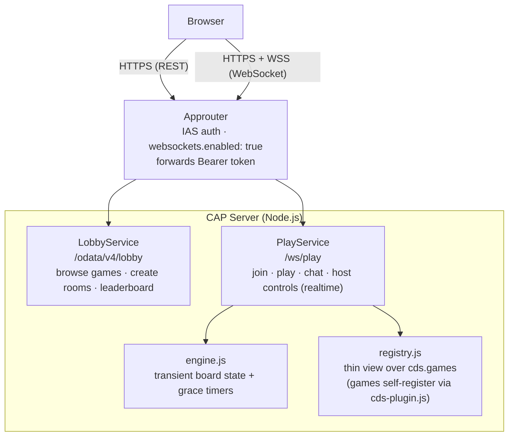

# AGENTS.md — cap-games Architecture

Multiplayer browser game platform on SAP BTP, built with CAP Node.js.
The platform handles all generic concerns (lobby, host, auth, leaderboard).
Games are self-registering plugin packages — adding a game never touches platform code.

---

## Design Principles

This codebase is a **hexagonal (ports-and-adapters)** architecture riding on
CAP's **agnostic abstractions**, and the design choices below are deliberate
applications of that — not incidental:

- **Games are the domain core, the platform is the adapter ring.** `game.js` is
  a pure reducer with *zero* CAP imports — it can't reach transport, DB, or
  timers even if it tried. Its only port to the outside is the `cds.games`
  facade (written by `cds-plugin.js`); the platform inverts the dependency so a
  packed game never couples to platform files by relative path. That strict
  boundary is why a game is unit-testable in isolation and why "never modify
  `srv/` for a new game" holds.
- **Agnostic persistence & auth (minimal assumptions).** `db` is in-memory
  SQLite locally → Postgres in `[production]`; `auth` is `mocked` locally → IAS
  in `[production]`. The domain assumes neither. This is what makes the whole
  platform + every game runnable locally with no BTP — design shifts *left*
  (domain, contract, tests first), infrastructure shifts *right* (deferred to
  the production profile).
- **Agnostic *location* via service bindings.** Cross-service calls go through
  `cds.connect.to('<Service>')` (see LobbyService → ProfileService for
  leaderboard gamertags in `srv/lobby-service.js`), *not* by importing the other
  service's impl. The call site is identical whether the provider is in-process
  today or split out to a remote binding later — the consumer stays agnostic to
  where it lives.

See qmacro's ["Timeless principles, agnostic design"](https://qmacro.org/blog/posts/2026/07/24/timeless-principles-agnostic-design-and-the-power-of-caps-abstractions/)
for the same principles stated CAP-first.

---

## Request Flow



**Two protocols, one reason:** Room setup (browse catalogue, create room) uses standard OData/REST — no WebSocket needed. Gameplay and chat use WebSocket for bidirectional realtime events.

---

## Project Structure

| Path | Purpose |
|---|---|
| `db/schema.cds` | Persistent entities: Rooms, Players, Matches, Leaderboard |
| `srv/lobby-service.cds/.js` | OData service — game catalogue, rooms, leaderboard, createRoom |
| `srv/play-service.cds/.js` | WebSocket service — all realtime actions + events |
| `srv/engine.js` | Transient board state, reconnect grace timers, default scoring, server-tick driver support |
| `srv/registry.js` | Thin helpers over the `cds.games` facade registry (`get`/`entry`/`all`/`ids`/`validate`) — games self-register, nothing is scanned |
| `srv/server.js` | Custom bootstrap — serves each game's `app/` at `/games/<id>` from its registered dir |
| `app/` | Shell: login, lobby, header/nav. Static files served by CAP. |
| `app/sdk.js` | SDK factory — `makeSdk()` (incl. `onState`/`onError`) + `makeEmitter()` |
| `app/shell/` | Importable UI components: `chat.js`, `players.js`, `host.js` |
| `games/<name>/` | Game plugin packages (npm workspaces) — `game.js` (pure) + `cds-plugin.js` + `app/` |

---

## Platform vs. Game

| Generic (Platform — never touch when adding a game) | Game-specific (Plugin) |
|---|---|
| Lobby, rooms, host management | Win condition |
| Settings mechanics (not content) | Settings schema |
| Join, kick, leave, reconnect | Board / state structure |
| Chat broadcast | Min/max players |
| Status machine (lobby → playing → finished) | Move validation |
| Leaderboard persistence | Optional: custom scoring |
| Auth (IAS), DB, WebSocket transport | Optional: extra actions/events |

**State split:**
- **Persistent (DB):** Rooms, Players, Matches, Leaderboard — survives restarts, never inconsistent
- **Transient (In-Memory):** Live board state, grace timers — intentionally lost on restart; stats are safe because they are written atomically on `finished`

---

## Status Machine

> **"Lobby" is two different things — don't confuse them:**
> - **Platform Lobby** (`view-lobby` in the shell) — the start page: browse games, create/join a room.
> - **Room status `lobby`** — a joined room's *waiting-room* phase (players gathering, host can configure/switch game/set roles, not yet started). Never shown to users as the word "lobby" — UI calls it "waiting for players" / "the room".

```
         join + start
lobby ────────────────► playing ───── win/draw ──► finished
  ▲                       │  ▲                         │
  │ backToRoom            │  │ reconnect (60s grace)   │ rematch
  │                       ▼  │                         │
  └──── backToRoom ── paused │                         ▼
                    (disconnect)               playing (rematch)
```

Status is persisted in `Rooms.status`. Board state is transient (`engine.js`).
After a server restart, `playing`/`paused` rooms stay in DB but have no board state — players rejoin and the host can `backToRoom` or `rematch`.

While a room is in status `lobby` (waiting room), the host may also:
- `switchGame(room, game)` — change the room's game before it starts; resets settings, re-splits existing players into player/spectator against the new game's `maxPlayers` (host first, then original join order), emits `gameSwitched` (platform swaps the mounted game UI automatically — no per-game code needed) and `roleChanged` for anyone bumped to spectator.
- `setRole(room, user, spectator)` — promote a spectator to player or demote a player to spectator (capped by `maxPlayers`); emits `roleChanged`.

---

## Extension Concept: Game Plugins

Each game is a CAP plugin: it ships a `cds-plugin.js`, which CAP's plugin loader
auto-executes during `cds.plugins` (before serving) — the game's hook into the
platform. That file imports the game's pure `game.js` and **self-registers** it
onto `cds.games`:

```js
// games/<id>/cds-plugin.js — the only CAP-touching file in a game
import cds from '@sap/cds';
import game from './game.js';
((cds.games ??= {}).<id> = { mod: game, dir: import.meta.url });
```

`cds.games` (a plain object keyed by game id) is the whole registry;
`srv/registry.js` is just typed helpers over it (`get`/`all`/`ids`/`entry`/
`validate`). **Why the `@sap/cds` facade and not an import of registry.js?** A
packed game can't reach platform files by relative path once deployed — the
`cds` singleton is the one channel every `@cap-games/*` package shares in both
dev and deploy. This is also why `engine.js` is never imported by a game.

```
npm install  →  cds.plugins runs every @cap-games/* cds-plugin.js  →  cds.games populated
      │
      ├─ srv/server.js (bootstrap): serves <game.dir>/app at /games/<id>
      └─ srv/play-service.js (served): validates each game's contract,
             calls game.extendService(srv) if present
                   │
                   ├─ LobbyService: exposes game in /Games catalogue
                   └─ PlayService:  move → game.applyMove(); on finished →
                                    game.score() / defaultScore(+pointsOf);
                                    each tick → game.onTick() (if meta.tick)
```

No change to platform code, no registry file to edit. Tests register the same
way: `(cds.games ??= {}).mygame = { mod }`.

### Optional: plugin-owned persistence + service

A game may bring its own CDS model — entities and an own (OData) service,
"an own CAP app inside the plugin" — with one more `cds` line:

```json
"requires": { "mygame": { "model": "@cap-games/mygame/srv/service.cds" } }
```

CAP includes every `requires.*.model` in the effective model: entities are
deployed (SQLite/Postgres) alongside the platform schema, the service is served
with its sibling `service.js` impl. Keep async work (cross-room persistence,
external calls) in such a service — never in `applyMove`, which stays pure
and synchronous.

### UI Architecture: Shell + SDK + Game

The shell owns login/lobby/header, AND the entire room chrome — players list,
chat, and host controls (switch-game, start, rematch, back-to-room) — for the
room's whole lifetime. A game module is only ever mounted once a match is
actually starting/active; it never renders any pre-start "lobby" UI and never
tracks its own roster.

```
Shell (owns the room)                        Game UI
──────────────────────────────────────       ──────────────────────────────────
Header/Nav, Login + Lobby                    renderSettings(el, sdk)  [optional]
WS transport + auto-reconnect                  ├─ host-only pre-start config
Room lifecycle (join/leave)                    │  (e.g. a menu preset) — shown
Persistent players + chat (whole session)      │  in the platform's waiting room
Waiting room (status 'lobby'):                 └─ takes over the Start trigger
  switch-game, Start (generic or the              itself if it needs to e.g.
  game's own via renderSettings)                  configure() before start()
Match controls (Rematch/Back to room,
  shown whenever status is 'finished')        mount(rootEl, sdk)
sdk.players — live roster, canonical,          ├─ called ONLY once the match is
  kept correct for the whole room session          starting/active (or you're
                                                    reconnecting into one)
                                                ├─ renders gameplay ONLY — board,
                                                │  hand, log, whatever your game needs
                                                ├─ sdk.onState(redraw)
                                                ├─ sdk.send('move', payload)
                                                └─ torn down on backToRoom/switchGame
```

**SDK object** passed to `renderSettings(el, sdk)` and `mount(rootEl, sdk)`:
```js
sdk = {
  room,                    // { id, game }
  me,                      // { user, spectator, isHost }
  players,                 // live roster [{ user, spectator, isHost }] — the
                           // platform keeps this current for the room's whole
                           // lifetime; read it directly, never track your own copy
  send(action, data),      // any WS action → PlayService (not just 'move')
  onState(cb),             // PREFERRED: subscribe to the state lifecycle
                           // (started/moved/finished/rematched/privateState)
                           // with the state pre-parsed — cb(state, event, raw).
                           // Absorbs the state-vs-data field split; returns an
                           // unsubscribe fn to call in cleanup.
  onError(cb),             // subscribe to `gameError` — cb({ message }); returns
                           // an unsubscribe fn.
  on(event, fn),           // low-level: subscribe to any server event by name
  off(event, fn),          // (use for non-state events, e.g. playerDisconnected)
  toast(msg),              // brief status in shell header
  leave(),                 // leave room
  nameOf(user),            // gamertag for a user id (falls back to the id
                           // itself if none set) — resolved via the
                           // platform's ProfileService cache
  avatarUrl(user),         // avatar image URL for a user id, or null —
                           // render your own fallback (e.g. initials)
}
```

Shell components (`/shell/*.js`) are platform-internal — mounted once by
`platform.js` for the room's whole session. Games never import them directly.

**Identity vs. display**: `user` (the IAS subject / dev-auth name) stays the
canonical identity everywhere it matters — room membership, moves, chat,
leaderboard keys, DB rows. A user's **gamertag + avatar are a display layer
only**, added via `ProfileService` (`srv/profile-service.cds/.js`, entity
`Profiles` in `db/schema.cds`) and never substituted in for `user` anywhere
in game logic. Reads are open (any authenticated user can look up anyone
else's gamertag/avatar — needed to label a room's roster); every write is a
dedicated action scoped to `req.user.id` (`saveGamertag`, `saveAvatar`),
never generic OData PUT/PATCH, so nobody can edit another user's row. The
avatar is served as a real CAP media stream (`LargeBinary @Core.MediaType`)
— `GET .../profile/Profiles(user='...')/avatar` — capped at 256 KB and a
png/jpeg/webp mime whitelist, enforced in `profile-service.js` (the service
also raises the default express body-parser limit via
`@cds.server.body_parser.limit`, otherwise a legitimate base64-encoded
upload would be rejected before that check ever runs). `platform.js` batch-
resolves and caches `{gamertag, hasAvatar}` per user (`ProfileService.
profilesOf`) and exposes it to games only through `sdk.nameOf`/
`sdk.avatarUrl` — a game never calls ProfileService itself. Currently wired
into the shell (header, players list, chat) only; adopting it inside a
game's own board/board-adjacent UI (e.g. Kaiten's tableau) is a deliberate
follow-up once the shell version is exercised live.

### Game Interface Contract

**State rules (required by engine):**
- Players are identified by their `user` id — the platform assigns **no** symbols.
  A game that wants marks (e.g. tic-tac-toe's X/O) derives them itself from the
  ordered `players` roster in `init`.
- `state.turn` must be a `user` id — engine reads it to track whose move it is
- `end.winner` must be a `user` id or `'draw'`
- Player vs spectator is a platform concern (`Players.spectator` flag); the game
  only ever receives players in its roster and via `applyMove`.

The pure `game.js` (no CAP imports) default-exports:
```js
export default {
  // Required
  meta: { name, minPlayers, maxPlayers },
  settingsSchema: { key: { type, values?, default } },
  init(settings, players)         // players: ordered [{ user, isHost }]
                                  // → { turn: players[0].user, /* your state */ }
  applyMove(state, move, user)    // → { state, end: null } | { state, end: { winner } } | { error }

  // Optional — scoring
  score(end, players)             // → [{ user, result: 'win'|'loss'|'draw', points }]
                                  //   omit to use platform default: W:3 D:1 L:0
  pointsOf(end, user)             // → number; keep the default W/D/L result but
                                  //   attach your own points (ignored if score() given)

  // Optional — hidden information (secret hands, face-down cards, roles)
  publicState(state)              // → redacted state broadcast to everyone in the room
  privateState(state, user)       // → per-player slice, delivered ONLY to that user

  // Optional — server-driven turns (e.g. a per-move timer). Requires
  // meta.tick = { everyMs }; the platform calls it on that interval while
  // playing and broadcasts any returned state like a real move.
  onTick(state, elapsedMs)        // → { state, end?, sys? } | null

  // Optional — extra WS actions/events; lives in a separate CAP-touching file
  // (see games/mttt/extend.js) so game.js itself stays CAP-free.
  extendService(srv)              // wired onto cds.games in cds-plugin.js
};
```

The **frontend** module (`games/<name>/app/index.js`) has a separate, smaller contract:
```js
export default {
  // Optional — pre-start configuration, shown in the platform's waiting room
  // (status 'lobby') for EVERY player, not just the host — the game decides
  // internally what a non-host sees there (or nothing). If your settings flow
  // needs its own Start trigger (e.g. configure() before start(), sometimes
  // async), render it here and call sdk.send('start', ...) yourself — the
  // platform's generic Start button is suppressed whenever this hook exists.
  renderSettings(el, sdk) { /* ... */ return () => { /* cleanup */ }; },

  // Required — called ONLY once a match is starting/active (or you're
  // reconnecting into one already playing/paused/finished). Never called
  // while the room is just waiting for players. Render gameplay only.
  mount(rootEl, sdk) { /* ... */ return () => { /* cleanup */ }; },
};
```

### Hidden Information (state projection)

By default the platform broadcasts the full `state` to the whole room — fine for
perfect-information games (TicTacToe). Games with secrets must **not** leak them
over the wire. If a game defines **both** `publicState` and `privateState`, the
platform redacts automatically:

- The room-scoped events (`started`/`moved`/`finished`/`rematched`) carry only
  `publicState(state)`.
- Each player additionally receives a `privateState` event — delivered to that
  user alone via the WebSocket `user` filter — carrying `privateState(state, user)`.
- On join/reconnect the platform sends the (re)joining user a private snapshot so
  they can render immediately.

Define neither hook → legacy behaviour (full state broadcast), unchanged.
This is a generic platform capability; game logic stays in `games/<name>/`.

### Adding a Game (4 files)

Use `games/tictactoe/` as reference — copy and adapt. `games/kaiten/` adds
`renderSettings` (pre-start config) and hidden-info projection; `games/mttt/`
adds `extendService` + `onTick`.

```
games/mygame/
  package.json     { "name": "@cap-games/mygame", "type": "module" }   // no "main"
  game.js          backend — pure module, default-exports the interface above (no CAP imports)
  cds-plugin.js    self-registers game.js onto cds.games (the 3-line snippet above)
  app/index.js     frontend — exports default { mount(rootEl, sdk), renderSettings? }
```

**`app/index.js`** is served automatically at `/games/<name>/index.js` by the platform (`srv/server.js` serves the registered dir's `app/`). The platform shell (`app/platform.js`) dynamically imports it and calls `mount()` only once the match is actually starting/active.

Games with a CAP-touching `extendService` or their own CDS model add an
`extend.js` and/or `srv/*.cds` (declared via `package.json` `cds.requires.*.model`)
— `cds-plugin.js` composes those onto the pure module at registration (see mttt).

Activate: add `"@cap-games/mygame": "*"` to root `package.json` dependencies, then `npm install`.

---

## Data Model

| Entity | Purpose |
|---|---|
| `Rooms` | Active rooms — game type, host, status, settings (JSON) |
| `Players` | Players per room — user id, spectator flag, isHost |
| `Matches` | Completed match history — winner, player snapshot, final state |
| `Leaderboard` | Aggregated stats per user+game — wins, losses, draws, points |
| `Profiles` | Display layer per user — gamertag, avatar (media stream) |

`Rooms` and `Players` are cleaned up automatically when a room empties.
`Matches`, `Leaderboard`, and `Profiles` are permanent.

---

## Conventions

- **CAP 10** — handlers use `class extends cds.ApplicationService { async init() }`
- **CQL global API** — `SELECT/INSERT/UPDATE/DELETE` used directly (no `cds.db.run`)
- **No state in service closures** — board state lives in `engine.js` module-level Map, never in handler closures
- **`game.js` is pure logic** — no CAP imports, no DB access, unit-tested directly. CAP-touching bits (self-registration, `extendService`) live only in `cds-plugin.js` / `extend.js`
- **Never modify `srv/` for a new game** — only `games/<name>/` and a dependency line

## TODO

- Refactor games' inline CSS (tictactoe/kaiten) onto the shared
  `var(--...)` design tokens so the light/dark theme toggle reaches game
  boards too — currently shell-only, games keep their own hardcoded palettes
