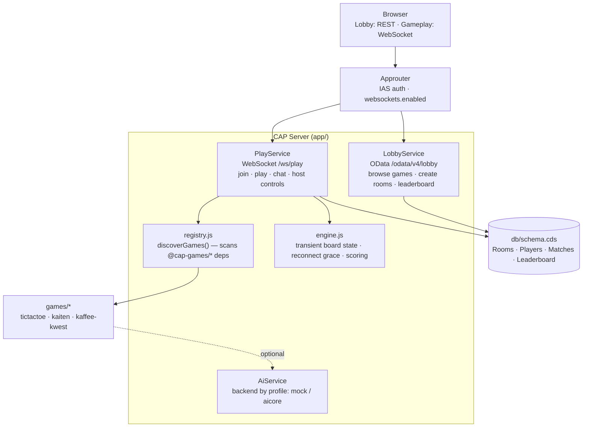

# cap-games

Multiplayer browser game platform on SAP BTP — built with CAP Node.js.
Games are plugin packages. Add a game: 4 files, one dependency line, done.

**Included:** TicTacToe, Kaiten, Kaffee-Kwest

---

## Architecture



Room isolation via `@ws.context` — plugin broadcasts events only to clients in the same room.
Persistent state: Rooms, Players, Matches, Leaderboard in SQLite (dev) / Postgres (prod).
Transient: live board state, chat (not persisted — intentional).

Games are zero-config: `registry.js` discovers any `@cap-games/*` npm dependency
as a game automatically (see "Adding a new game" below). `AiService` is
optional platform infrastructure — any game can connect to it for LLM calls
without knowing which backend answers.

---

## Local Development

```sh
npm install
cds watch app
```

- LobbyService: `http://localhost:4004/odata/v4/lobby`
- PlayService:  `ws://localhost:4004/ws/play`
- Auth: `mocked` locally. Users: `alice`, `bob`, `carol`

### Tools

```sh
# websocat for WebSocket testing — install via your package manager, e.g.:
brew install websocat        # macOS
cargo install websocat       # or download a release binary
```

---

## Quick Game (copy-paste)

See [`games/tictactoe/README.md`](games/tictactoe/README.md) for a full
copy-paste walkthrough (create room → join → play → finish) using the
reference game — the same file new game authors start from when copying
`games/tictactoe/` as a template.

---

## Lobby REST API

`GET /odata/v4/lobby/Games` — game catalogue
`GET /odata/v4/lobby/Rooms` — active rooms
`GET /odata/v4/lobby/Leaderboard` — leaderboard
`POST /odata/v4/lobby/createRoom` body: `{"game":"tictactoe"}` → roomId

Auth header: `Authorization: Basic <base64(user:user)>` (dev mocked)

---

## WebSocket Actions (PlayService)

| Action | Who | Status | Effect |
|--------|-----|--------|--------|
| `join(room)` | anyone | any | Join room; creator (via createRoom) becomes host |
| `configure(room, settings)` | host | lobby | Set game settings (JSON string) |
| `start(room)` | host | lobby | → playing |
| `move(room, data)` | current turn (`user` id) | playing | Game move (JSON string, game-specific) |
| `rematch(room)` | host | finished | → playing, keep players |
| `backToLobby(room)` | host | any | → lobby, all notified |
| `kick(room, user)` | host | any | Remove player/spectator |
| `leave(room)` | anyone | any | Leave voluntarily |
| `chat(room, text)` | anyone | any | Broadcast chat message (transient) |

## WebSocket Events

| Event | Key payload |
|-------|-------------|
| `joined` | `{ room, player, spectator, host, status }` |
| `configured` | `{ room, settings }` |
| `started` | `{ room, firstTurn }` — `firstTurn` is a `user` id |
| `moved` | `{ room, data }` — JSON game state |
| `finished` | `{ room, winner, state }` — `winner` is a `user` id or `'draw'` |
| `rematched` | `{ room, firstTurn }` |
| `lobbyReset` | `{ room }` |
| `playerLeft` | `{ room, player, newHost }` |
| `playerKicked` | `{ room, player }` |
| `playerDisconnected` | `{ room, player }` |
| `playerReconnected` | `{ room, player }` |
| `chatMessage` | `{ room, player, text, ts }` |
| `gameError` | `{ room, message }` |

## Reconnect

Disconnect during `playing` → room paused (60s grace).
Reconnect: `join` same room → `playerReconnected`, game resumes.
Timeout (60s): player removed, host succession, room → lobby.

## Host Succession

Host leaves/disconnects/is kicked → next remaining player becomes host.
Room auto-deleted when all players gone.

---

## Adding a new game (Plugin)

Copy `games/tictactoe/` as a starting point. Four files — no wiring code:

**1. `games/mygame/package.json`** — declares the game (CAP merges the `cds` section)
```json
{
  "name": "@cap-games/mygame", "version": "1.0.0", "type": "module", "main": "index.js"
}
```
The name is all it takes: every `@cap-games/*` dependency is discovered as a game
by convention (id = the name after the scope) — **no `cds.games` config needed**.

**2. `games/mygame/cds-plugin.js`** — empty marker file (CAP loads packages that
have one). The platform serves the game's `app/` at `/games/mygame` automatically
(override the UI folder with a `cds.games.mygame.ui` entry if needed).

**3. `games/mygame/index.js`** — backend logic. Players are identified by their
`user` id — the platform assigns no symbols; a game that wants marks (e.g.
tic-tac-toe's X/O) derives them itself from the `players` roster in `init`.
```js
module.exports = {
  meta: { name: 'My Game', minPlayers: 2, maxPlayers: 4 },
  settingsSchema: { /* optional */ },

  // players: ordered roster [{ user, isHost }]; set state.turn to a user id —
  // the platform reads it to track whose move it is
  init(settings = {}, players = []) { return { turn: players[0]?.user, /* your state */ }; },

  // user = the acting player's id; end.winner = user | 'draw'
  applyMove(state, move, user) {
    // return { error: 'reason' }
    // return { state: newState, end: null }
    // return { state: newState, end: { winner: user|'draw' } }
  },
  score(end, players) { /* optional */ },
  extendService(srv)  { /* optional */ },
};
```

**4. `games/mygame/app/index.js`** — frontend (ES module, full UI control)
```js
export default {
  mount(rootEl, sdk) {
    // Build your complete game UI into rootEl.
    // sdk.on('started'/'moved'/'finished', handler) — listen to server events
    // sdk.send('move', payload) — send moves
    // optional: import shell components
    //   import { mountChat }    from '/shell/chat.js'
    //   import { mountPlayers } from '/shell/players.js'
    //   import { mountHostControls } from '/shell/host.js'
    return () => { /* cleanup */ };
  }
};
```

**Activate:** add `"@cap-games/mygame": "*"` to root `package.json` dependencies, then `npm install`. That dependency *is* the registration — the platform discovers it automatically.

The platform provides: lobby, host, join, kick, settings, chat, reconnect, status machine, leaderboard — automatically. Your game only implements the rules and the board UI.

**Optional — own persistence/service:** a game can bring its own CDS model
(entities + OData service) with one more line in its `cds` section — see
`games/kaffee-kwest/` as reference:
```json
"requires": { "mygame": { "model": "@cap-games/mygame/srv/service.cds" } }
```

**Optional — AI Service:** the platform exposes `AiService`
(`cds.connect.to('AiService')`) for any game that wants LLM calls — the
backend is picked by profile (`mock` locally, `aicore` in hybrid/production),
no per-game config needed. See `docs/architecture/kaffee-kwest.md` for the
worked example.

---

## Debug Logging

```sh
CDS_LOG_LEVELS_game=info cds watch   # game events (default on)
DEBUG=websocket cds watch            # WS transport: connect/disconnect
```

---

## Deploy to BTP (Cloud Foundry Trial)

```sh
mbt build
cf deploy mta_archives/cap-games_1.0.0.mtar -e trial.mtaext
```

AI Core is external/cross-account — no `aicore` service instance is
provisioned here. `trial.mtaext` (copy from `trial.mtaext.example`, gitignored,
never commit the filled-in version) supplies `AICORE_DEPLOYMENT_ID`,
`AICORE_REASONING_MODEL`, and `AICORE_SERVICE_KEY` as plain env vars instead
— the SAP AI SDK reads them natively, same as local dev.

Creates:
- `cap-games-srv` — CAP server
- `cap-games` — Approuter (IAS auth)
- `cap-games-ias` — IAS identity service
- `cap-games-postgres` — PostgreSQL database (`postgresql-db`/`trial`)

**Trial-account data is ephemeral by design:** BTP trial subaccounts expire
and get deleted, wiping every service instance in them regardless of which
database is used. No backup/export strategy is implemented — this deployment
is a demo/showcase, not a durable store.

**Post-deploy — IAS Self-Registration:**
1. BTP Cockpit → Services → Instances → `cap-games-ias` → open IAS Admin Console
2. Applications → `cap-games` → Authentication & Access
3. Enable **Self-Registration** → Save

**Connect (deployed):**
```sh
cf app cap-games   # get approuter URL
# REST: https://<approuter-url>/odata/v4/lobby/Games
# WS:   wss://<approuter-url>/ws/play  (after IAS login for session cookie)
```

---

## base64 reference (local mocked auth)

| Header type | User | Value |
|---|---|---|
| `Authorization: Basic <value>` | alice | `YWxpY2U6YWxpY2U=` |
| `Authorization: Basic <value>` | bob | `Ym9iOmJvYg==` |
| `Authorization: Basic <value>` | carol | `Y2Fyb2w6Y2Fyb2w=` |
| `Cookie: X-Authorization=Basic <value>` | alice | `YWxpY2U6YWxpY2U` |
| `Cookie: X-Authorization=Basic <value>` | bob | `Ym9iOmJvYg==` |

HTTP (OData): use `Authorization` header.
WebSocket (websocat): use `Cookie: X-Authorization=Basic ...` header.

---

## TODO (later)

- Team-play support (multiple players per side)
